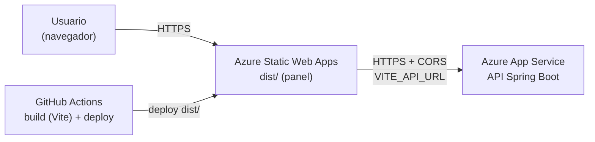

# Despliegue en Azure — Panel web

## 1. Arquitectura

**Azure Static Web Apps (plan Free)** sirviendo los archivos estáticos de `dist/`. La API
sigue desplegada aparte, en Azure App Service (ver `AZURE_DEPLOYMENT.md` del repo
`technical-reports`), en otro dominio (`https://<app>.azurewebsites.net` o un dominio
propio). El panel le habla por HTTPS directo, no por el _linked backend_ de Static Web
Apps, así que la API necesita CORS habilitado para el dominio del panel — ese cambio va en
el repo del backend, no en este.



## 2. Por qué Static Web Apps

- 1-2 usuarios, sin necesidad de servidor: el plan Free alcanza de sobra.
- Certificado HTTPS y CDN incluidos, sin nada que mantener.
- `staticwebapp.config.json` en la raíz resuelve el _fallback_ de rutas de la SPA
  (`navigationFallback`): cualquier ruta que no sea un archivo real (`/reports/42`, por
  ejemplo) sirve `index.html` para que React Router la resuelva en el cliente.

## 3. Aprovisionamiento (Azure CLI, referencial)

```bash
RG=rg-technical-reports-prod   # el mismo grupo de recursos del backend
LOC=eastus2

az staticwebapp create \
  -g $RG -n swa-technical-reports-panel -l $LOC \
  --sku Free \
  --source https://github.com/<org>/technical-reports-wapp \
  --branch main \
  --app-location "/" \
  --output-location "dist" \
  --login-with-github
```

`--login-with-github` crea el recurso, conecta el repo y agrega automáticamente el
workflow `.github/workflows/azure-static-web-apps.yml` **y** el secreto
`AZURE_STATIC_WEB_APPS_API_TOKEN` en el repo. Como este repo ya trae su propio workflow
(que compila con Vite en vez del _Oryx build_ automático de Azure, para poder pasarle
`VITE_API_URL`), conviene crear el recurso sin conectar el repo
(`az staticwebapp create` sin `--source`) y copiar el token a mano:

```bash
az staticwebapp secrets list -n swa-technical-reports-panel --query "properties.apiKey" -o tsv
```

Ese valor va como secreto de GitHub `AZURE_STATIC_WEB_APPS_API_TOKEN` (Settings → Secrets
and variables → Actions).

## 4. Configuración

| Dónde                       | Variable                          | Valor                                                                                    |
| --------------------------- | --------------------------------- | ---------------------------------------------------------------------------------------- |
| Secreto de GitHub           | `AZURE_STATIC_WEB_APPS_API_TOKEN` | _deployment token_ de la Static Web App (paso anterior)                                  |
| Variable de GitHub (`vars`) | `VITE_API_URL`                    | URL pública de la API, p. ej. `https://app-scontrol-technical-reports.azurewebsites.net` |

`VITE_API_URL` se hornea en el build (Vite reemplaza `import.meta.env.VITE_API_URL` en
tiempo de compilación), así que un cambio de URL de la API requiere volver a desplegar el
panel, no solo cambiar una variable de entorno en runtime.

## 5. Cambio pendiente en el backend

`docs/AZURE_DEPLOYMENT.md` del repo `technical-reports` dice hoy "CORS: no se configura
mientras no haya un frontend web en otro dominio". Antes de este despliegue hace falta
habilitar CORS en la API para el dominio de la Static Web App
(`https://<nombre>.azurestaticapps.net`, o el dominio propio si se configura uno).

## 6. Dominio propio (opcional)

Azure Static Web Apps admite un dominio propio con certificado gestionado gratuito
(`az staticwebapp hostname set`). Si se usa (p. ej. `panel.scontrol.pe`), agregar también
ese dominio a la configuración de CORS del backend.
